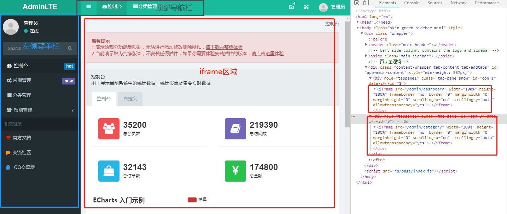
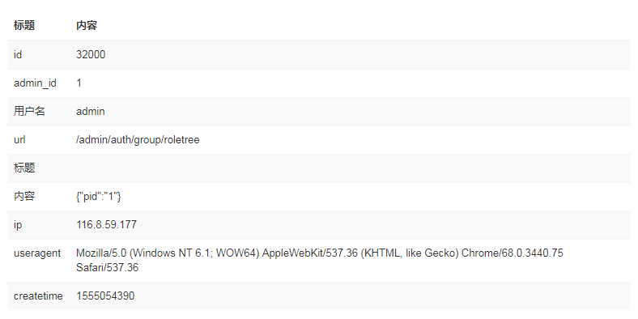
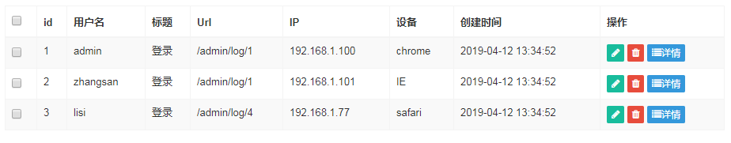
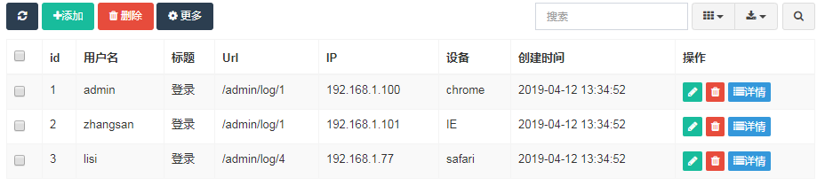
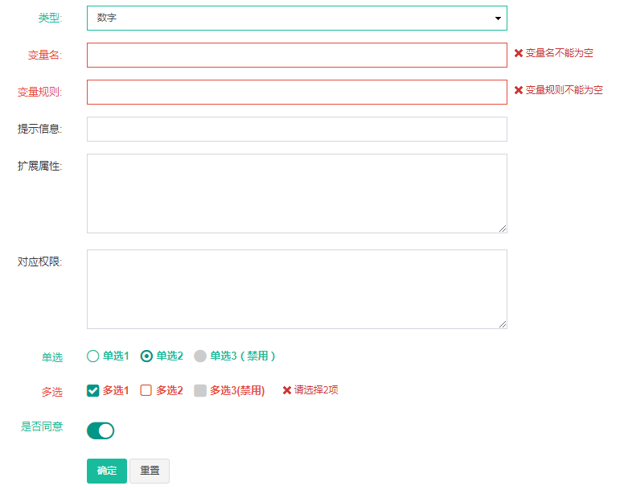
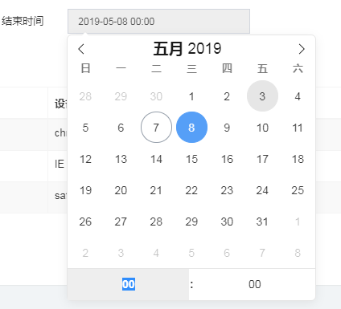
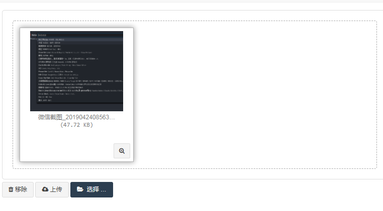
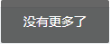

## 项目说明

### 1. 项目结构

		├─.gitignore
		├─app.js     //koa2 入口文件
		├─package.json
		├─readme.md     
		├─views       //所有html模板
		|   ├─demo.html
		|   ├─detail.html
		|   ├─edit.html
		|   ├─index.html
		|   ├─login.html
		|   ├─upload.html
		|   ├─general
		|   |    ├─attachment.html
		|   |    └config.html
		|   ├─dashboard
		|   |     └index.html
		|   ├─category
		|   |    └index.html
		|   ├─auth
		|   |  ├─admin.html
		|   |  └adminlog.html
		├─routes           //koa2 路由配置
		|   ├─index.js
		|   └users.js
		├─public
		|   ├─js
		|   | ├─common_dep.js //公共依赖js,所有页面均需引入，包含第三方公共库（jq,bootstrap,layer等）和一些公共方法
		|   | ├─plugins  //项目中用到的js插件
		|   | |    ├─echarts.min.js  //可视化图表,没有囊括所有，只包含部分常用的，可以通过官网手动定制
		|   | |    ├─fileinput.min.js // 文件上传插件
		|   | |    └flatpickr.min.js   //时间选择插件
		|   | ├─page
		|   | |  └index.js   //入口页面的js文件，含菜单类的初始化，前端路由初始化等（建议每个页面撰写一个单独的js，只包含所在页面内执行，可以抽离出来，写在模板的script标签内）
		|   ├─img           //所有图片相关
		|   |  ├─avatar.png
		|   |  ├─icon-ext.png
		|   |  ├─icon.png
		|   |  ├─loading-0.gif
		|   |  ├─loading-1.gif
		|   |  ├─loading-2.gif
		|   |  ├─loginbg.jpg
		|   |  ├─validator_default.png
		|   |  └validator_simple.png
		|   ├─fonts
		|   |   └fontawesome-webfont.woff2 //字体库
		|   ├─css
		|   |  └backend.min.css   ////公共依赖css,所有页面均需引入
		├─bin
		|  └www    //koa2 配置

### 2. 项目运行 
推荐使用yarn,也可用npm

	yarn install
    
	yarn start

  运行浏览器访问：http://localhost:3002/

### 3. 界面交互设计

页面左侧菜单栏每一条可点击项目的dom结构如下：

	<li class=""><a href="/admin/category" data-nav-id="3">
    <i class="fa fa-list fa-fw"></i>分类管理
    </a></li>

其中，href与data-nav-id 是必须的，data-nav-id可以随意定义，但要保证唯一性。系统会根据此id作为前端唯一标识，从而渲染出来对应的左侧菜单，顶部导航，中间iframe页面的内容，且实现了三者的互相关联性；url中出现的`#/admin/general/config?reftab=6`无须关注，为前端hash路由，不要进行手动干扰修改，url中需要传递的参数依旧可以通过search部分进行传递。

### 4. 页面图标样式
页面已经引入fontawesome字体图标库，可访问[fontawesome字体图标库](http://fontawesome.dashgame.com/)添加或修改图标样式

## 项目功能组件

### 1. 表格
#### 1.1 简易表格
如果想实现一个简易的不含操作按钮的表格样式，dom结构如下：

		<table class="table table-striped">
		<thead>
		  <tr>
		    <th>标题</th>
		    <th>内容</th>
		  </tr>
		</thead>
		<tbody>
		  <tr>
		    <td>id</td>
		    <td>32000</td>
		  </tr>
		  <tr>
		    <td>admin_id</td>
		    <td>1</td>
		  </tr>
		  <tr>
		    <td>用户名</td>
		    <td>admin</td>
		  </tr>
		</tbody>
		</table>

效果如下：  

#### 1.2 含操作的表格
如果想实现一个包含操作动作的表格，dom结构如下：

	<table class="table table-hover table-bordered table-striped" id="my-table-wrap">
      <thead class="thead-dark">
        <tr>
            <!-- 全选与单选的配置有不同->
			<!-- class="table-check-all" 表明是每一项的单选按钮-->
            <!-- data-toggle="operate-table"  表明是需要操作的按钮 -->
			<!-- data-table-id  操作的是哪个表格id,页面会出现多个表格的情况 -->
	        <!-- data-button-type 操作的动作，选中动作 -->
          <td><input 
            data-table-id="my-table-wrap" 
            data-toggle="operate-table"  
            data-button-type="check"
            class="table-check-all"
            type="checkbox"></td>
          <th>id</th>
          <th>用户名</th>
          <th>标题</th>
          <th>Url</th>
          <th>IP</th>
          <th>设备</th>
          <th>创建时间</th>
          <th>操作</th>
        </tr>
      </thead>
      <tbody>
			<!-- class="table-check-one" 表明是每一项的单选按钮-->
            <!-- data-toggle="operate-table"  表明是需要操作的按钮 -->
	        <!-- data-table-id  操作的是哪个表格id,页面会出现多个表格的情况 -->
	        <!-- data-value  选中时需要传递给后台的参数，后台用来区分批量操作的是哪一个 -->
	        <!-- data-button-type 操作的动作，选中动作 -->
		  <tr 
	      data-table-id="my-table-wrap" 
	      data-toggle="operate-table"  
	      data-button-type="check"
	      data-value="a" 
	      class="table-check-one" >
	      <td><input type="checkbox"></td>
	      <td>1</td>
	      <td>admin</td>
	      <td>登录</td>
	      <td>/admin/log/1</td>
	      <td>192.168.1.100</td>
	      <td>chrome</td>
	      <td>2019-04-12 13:34:52</td>
	      <td>
	        <!-- data-toggle="operate-table"  表明是需要操作的按钮 -->
	        <!-- data-original-title  按钮hover时的提示 -->
	        <!-- data-table-id  操作的是哪个表格id,页面会出现多个表格的情况 -->
	        <!-- data-row-index  操作的是第几行 -->
	        <!-- data-button-type 操作的动作-->
	        <!-- data-url 修改时编辑的页面地址 ，查看详情时页面的地址, 删除时的接口地址-->
	        <a 
	        href="javascript:;"
	        data-url="/admin/edit?id=0" 
	        class="btn btn-xs btn-success btn-editone" 
	        data-toggle="operate-table" 
	        data-table-id="my-table-wrap"   
	        data-row-index="0" 
	        data-button-type="edit"
	        data-original-title="编辑"><i class="fa fa-pencil"></i></a> 
	        <a 
	        href="javascript:;"
	        data-url="/admin/category/del/0"
	        class="btn btn-xs btn-danger btn-delone" 
	        data-toggle="operate-table" 
	        data-table-id="my-table-wrap" 
	        data-row-index="0" 
	        data-button-type="del" 
	        data-original-title="删除"><i class="fa fa-trash"></i></a>
	        <a 
	        href="javascript:;"
	        data-url="/admin/detail?id=8"
	        class="btn btn-info btn-xs btn-detail btn-dialog" 
	        data-toggle="operate-table" 
	        data-table-id="my-table-wrap"   
	        data-row-index="0" 
	        data-button-type="detail"
	        data-original-title="详情"><i class="fa fa-list"></i>详情</a> 
	      </td>
	    </tr>
      </tbody>
      </table>
效果图如下：  

每个表格操作的按钮动作配置如上面代码所示。

#### 1.3 表格工具栏

如果需要添加顶部工具栏，需要新增的dom结构为：

    <!-- 表格通用筛选项,默认隐藏-->
    
省略...

    <!-- 表格工具栏-->
	

      

        

          <a 
          href="javascript:;"
          data-url=""
          data-toggle="operate-table" 
          data-table-id="my-table-wrap" 
          class="btn btn-primary btn-refresh" 
          title="刷新" 
          data-button-type="refresh"><i class="fa fa-refresh"></i></a> 
          <a 
          href="javascript:;"
          data-url="/admin/edit" 
           data-toggle="operate-table" 
           data-table-id="my-table-wrap" 
           class="btn btn-success btn-add" 
           data-button-type="add"
           title="添加"><i class="fa fa-plus"></i>添加</a>
          <a 
          href="javascript:;"
          data-url="/admin/del"
          data-toggle="operate-table" 
          data-table-id="my-table-wrap" 
          class="btn btn-danger btn-del"
          data-button-type="multi-del"
          title="删除"><i class="fa fa-trash"></i> 删除</a>
          

            <a class="btn btn-primary btn-more dropdown-toggle" data-toggle="dropdown"><i
                class="fa fa-cog"></i> 更多</a>
            <ul class="dropdown-menu text-left" role="menu">
             <li><a 
                class="btn btn-link btn-multi"  
                data-table-id="my-table-wrap" 
                data-toggle="operate-table" 
                href="javascript:;"
                data-url="/admin/show"
                data-button-type="multi-show"
                ><i class="fa fa-eye"></i>设为正常</a></li>
              <li><a 
                class="btn btn-link btn-multi" 
                data-table-id="my-table-wrap"  
                data-toggle="operate-table" 
                href="javascript:;"
                data-url="/admin/hide"
                data-button-type="multi-hide"
                ><i class="fa fa-eye-slash"></i>设为隐藏</a></li>
            </ul>
          

        

      

      

        <button 
        class="btn btn-default" 
        type="button" 
        data-toggle="operate-table" 
        data-table-id="my-table-wrap"
        data-button-type="filter"
        title="普通搜索"><i class="fa fa-search"></i></button>

      

        
<button type="button" aria-label="columns"
            class="btn btn-default dropdown-toggle" data-toggle="dropdown" aria-expanded="false"><i
              class="fa fa-th"></i> </button>
          <ul class="dropdown-menu" role="menu">
            <form action="/uptate/xxx" method="POST">
            <li role="menuitem"><label><input type="checkbox" name="id" value="1" checked="checked"> ID</label></li>
            <li role="menuitem"><label><input type="checkbox" name="type" value="2" checked="checked"> 栏目类型</label>
            </li>
            <li role="menuitem"><label><input type="checkbox" name="name" value="3" checked="checked"> 名称</label></li>
            <li role="menuitem"><label><input type="checkbox" name="nickname" value="4" checked="checked"> 昵称</label>
            </li>
            <li role="menuitem"><label><input type="checkbox" name="flag" value="5" checked="checked"> 标志</label></li>
            <li role="menuitem"><label><input type="checkbox" name="image" value="6" checked="checked"> 图片</label>
            </li>
            <li role="menuitem"><label><input type="checkbox" name="weigh" value="7" checked="checked"> 权重</label>
            </li>
            <li role="menuitem"><label><input type="checkbox" name="status" value="8" checked="checked"> 状态</label>
            </li>
            <li role="menuitem"><label><input type="checkbox" name="operate" value="9" checked="checked"> 操作</label>
            </li>
            <li role="menuitem"><label><input type="checkbox" name="operate" value="9" checked="checked"> 操作</label>
            </li>
            <li style="padding-left: 19px"><button type="submit" class="btn btn-success btn-embossed">确定</button></li>
            </form>
          </ul>
        

        
<button class="btn btn-default dropdown-toggle" aria-label="export type" title="导出数据"
            data-toggle="dropdown" type="button" aria-expanded="false"><i class="fa fa-download icon-share"></i>
            </button>
          <ul class="dropdown-menu" role="menu">
            <li role="menuitem" data-type="json"><a href="javascript:void(0)">JSON</a></li>
            <li role="menuitem" data-type="xml"><a href="javascript:void(0)">XML</a></li>
            <li role="menuitem" data-type="csv"><a href="javascript:void(0)">CSV</a></li>
            <li role="menuitem" data-type="txt"><a href="javascript:void(0)">TXT</a></li>
            <li role="menuitem" data-type="doc"><a href="javascript:void(0)">MS-Word</a></li>
            <li role="menuitem" data-type="excel"><a href="javascript:void(0)">MS-Excel</a></li>
          </ul>
        

      

      
<input 
        class="form-control"
        data-url="/admin/search"
        data-toggle="operate-table" 
        data-table-id="my-table-wrap" 
        data-button-type="search"
        type="text" placeholder="搜索">

    

效果如图所示：

参数配置基本同表格内操作按钮的配置，只是每个按钮的操作类型：`data-button-type`不同。如果需要扩展其他data-button-type,在common_dep.js中添加对应动作代码即可。

#### 1.4 分页
分页功能已经全局配置，只需在页面添加对应dom节点即可，分页的每次点击，将会向后端发送一次请求（url会携带上对应参数：/admin/auth/adminlog?pagesize=10&page=3），同时替换当前页面

	

	   

配置参数说明：

	data-toggle="table-pagination" 该标识表示所在标签为分页容器，将会自动进行初始化配置
    data-url：翻页时，跳转的路由地址
	data-table-id：分页功能对应表格的id(一个页面可能存在多个表格的情况)
	data-page-size：每页多少条
	data-page-total：总共条数
	data-page-index：当前第几页

效果如图所示：

#### 1.5 拖放排序
若需要使用拖放排序功能请对应的父级添加类名（drag-wrap），拖拽按钮添加对应的类名即可（btn-dragsort），目前拖放排序只是前段交互变化，不涉及后端逻辑。拖放按钮会把他的父级dom整个进行排序，使用插件为dragsort，全局已经引入，并且完成初始化。

	

	  <dd class="form-inline"><input type="text">
	  <i class="fa fa-arrows"></i>
	 </dd>
	

如果以上无法满足需求，请按照[官方文档](https://archive.codeplex.com/?p=dragsort)，自行进行初始化配置

### 2. 表单
表单类全部均采用form方式进行提交，选用html现有表单标签即可。如需改为ajax无刷新提交，请@王明欢进行协助修改。

下面重点介绍下表单校验部分：  

表单校验采用nice validator,已全局配置完毕，页面中直接使用即可。详细介绍请参见[官方文档](https://validator.niceue.com/docs/custom-rules.html)  

对于type="text"的input标签，如果必填则添加data-rule="required;"属性即可：

		<input type="text" data-rule="required;">

如果需要其他校验规则，通过分号分割进行配置即可，更多用法请参见[内置规则和自定义规则](https://validator.niceue.com/docs/core-rules.html)

		<input type="text" data-rule="required;length(6~16)">

对于select标签 添加data-rule="required;"即可，

		<select class="form-control" name="_type" data-rule="required;">
          <option value="">请选择</option>
          <option value="number">数字</option>
          <option value="txt">文本</option>
          <option value="date">日期</option>
        </select>
对于type="radio"和type="checkbox"的input组件，只需要在一个一组选项内的任一个标签上添加data-rule="checked"即可（注意，不是data-rule="required;"）

		

		<label for="sex" class="control-label col-xs-12 col-sm-2" >单选</label>
		

		    <label>
		        <input type="radio" name="sex" value="1" data-rule="checked">单选1
		      </label>
		      <label>
		        <input type="radio" name="sex" value="2">单选2
		      </label>
		      <label>
		        <input type="radio" disabled name="sex" value="3">单选3（禁用）
		      </label>
		

		

		

		<label for="ask" class="control-label col-xs-12 col-sm-2">多选</label>
		

		        <label>
		          <input type="checkbox" name="ask" value="1" data-rule="checked(2)">多选1
		        </label>
		        <label>
		          <input type="checkbox" name="ask" value="2">多选2
		        </label>
		        <label data-rule="">
		          <input type="checkbox" disabled name="ask" value="3">多选3(禁用)
		        </label>
		        

		

效果预览：

### 3. 可视化图表

对应页面引入js/plugins/echarts.min.js 文件，使用教程参见官网文档：[echart-demo](https://echarts.baidu.com/examples/)

### 4. 时间选择控件

首先，对应页面引入js/plugins/flatpickr.min.js 文件。

其次，页面放入对应标签，注意，请在对应标签上添加class:"date-time-picker"

	<input 
	class="date-time-picker" 
	data-date-format="Y-m-d H:i"
	data-min-date="2019-4-1 00:00"
	data-max-date="2019-4-8 23:59"
	data-disable-time="false"
	data-default-date="2019-4-2 12:00"
	placeholder="请选择时间"
	name="s-time">

配置参数说明：

	data-date-format：时间格式化配置，默认为"Y-m-d H:i"
    data-min-date：控制选择的时间范围的最小日期，如果不需要，不配置即可，注意与data-date-format的格式相匹配
	data-min-date：控制选择的时间范围的最大日期，如果不需要，不配置即可，注意与data-date-format的格式相匹配
	data-disable-time：为true时，则只展示日期选择功能，同时请将data-date-format设置为：Y-m-d
	data-default-date：初始化时的默认值，不设置则显示placeholder中的内容

如果以上无法满足需求，请按照[官方文档](https://flatpickr.js.org/getting-started/)，自行进行初始化配置  

效果预览：

### 5. 文件上传控件

首先，对应页面引入js/plugins/flatpickr.min.js 文件。

其次，页面放入对应标签，注意，请在对应标签上添加class:"files-upload-wrap"

	<input 
      id="files-upload-1"
      class="files-upload-wrap" 
      data-default-imgurl="https://zhwimg.zuhaowan.com/images/gg_img/2019-04-16/5cb56d7d8ff8b.jpg"
      data-upload-url="/api/upload"
      data-drop-zone="true"
      data-accept="jpg,png,gif"
      data-extra-data='TOKEN=123&name=456'
	  data-max-size="1000"
      type="file">
配置参数说明：
    
	data-default-imgurl：初始化时的默认文件地址
	data-upload-url：上传文件的地址
	data-drop-zone：为true时，将展示拖拽区域
	data-accept：允许上传的文件类型
	data-extra-data：ajax异步上传时的附加参数，请用用&符进行拼接
    data-max-size：文件大小的上限，单位为kb

如果以上无法满足需求，请按照[官方文档](http://plugins.krajee.com/file-input)，自行进行初始化配置

效果预览：

### 6. 弹窗/提示类
全局已引入layer.js, 详细使用教程参见官网文档：[layer官方文档](http://layer.layui.com/)

询问类：

	layer.confirm('确认退出？', {
      btn: ['确定', '取消'] //按钮
    }, function (index) {
      layer.close(index);//关闭弹窗
      //确定相关功能
    },function(index){
		layer.close(index);//关闭弹窗
		//取消相关功能
		})
弹窗提示类

	layer.alert("重置成功", {
	                icon: 6
	            })

 

toast提示类

   	layer.msg("没有更多了")

 

顶部Notification悬浮提示：

	layer.success("我是成功类的样式提示")

	layer.info("我是正常类的样式提示")

	layer.error("我是失败警告类的样式提示")

   
 

## 7. 后续扩展

如果功能不满足需求，可在html页面中自行引入对应文件(js，css等)，注意每个页面都需要引入 `backend.min.css` 和 `common_dep.js`这两个文件
